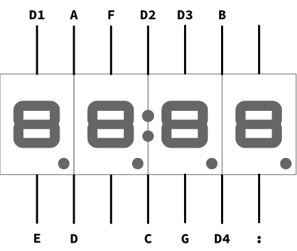

# 7-Segment display on RaspberryPi

This repository contains two examples of controlling a seven-segment display using Python and a Raspberry Pi.

## Examples
### `/simple`
Drive the display directly using 7 GPIO pins. It is accompanied by a [blog post](https://www.noumansaleem.com/avr/2018/08/11/seven-segment-display-raspberry-pi-python.html).

### `/shift-register`
Control the display through a shift register. This example reduces the required GPIO pins from 7 to 3.
